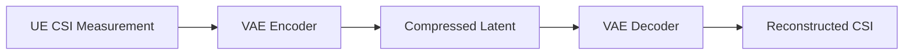

# VAE for CSI Feedback Proof of Concept

## Overview
This proof of concept demonstrates a Variational Autoencoder (VAE) for compressing Channel State Information (CSI) feedback in massive MIMO systems. The VAE learns to encode CSI measurements into a compressed latent representation that can be efficiently transmitted to the base station, where it's decoded to reconstruct the original CSI.

## Mermaid Diagram

## Implementation
A basic PyTorch implementation is provided in `vae_csi.py` that:
1. Simulates CSI data (complex channel matrices)
2. Implements VAE encoder/decoder architecture
3. Trains the model to minimize reconstruction loss

## Usage
1. Install requirements: `pip install torch numpy`
2. Run: `python vae_csi.py`
