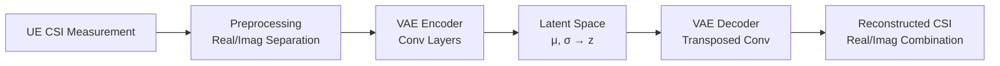

# VAE for CSI Feedback Compression

## Overview
This proof of concept demonstrates a Variational Autoencoder (VAE) for compressing Channel State Information (CSI) feedback in massive MIMO systems. The VAE learns to encode high-dimensional CSI measurements into a compressed latent representation that can be efficiently transmitted to the base station, where it's decoded to reconstruct the original CSI with minimal distortion.

## Technical Approach
- **Data Representation**: CSI matrices represented as separate real/imaginary channels
- **Architecture**: Convolutional encoder/decoder with latent bottleneck
- **Loss Function**: Combined reconstruction error and KL divergence
- **Normalization**: Tanh activation ensures output in [-1, 1] range



## Implementation Details
### Model Architecture
| Component        | Layers                                                                 | Output Shape |
|------------------|------------------------------------------------------------------------|-------------|
| **Encoder**      | Conv2d(2→8, k=3,s=2) → ReLU → Conv2d(8→16, k=3,s=2) → ReLU → Flatten  | (16×2×2)    |
| **Latent**       | Linear(64→16) → μ, Linear(64→16) → logσ² → Reparameterization        | (16)        |
| **Decoder**      | Linear(16→64) → Unflatten → ConvTranspose2d(16→8) → ReLU → ConvTranspose2d(8→2) → Tanh | (2×8×8) |

### Loss Function

L = ||x - x̂||² (Reconstruction)
  + β * D_KL(q(z|x) || p(z)) (Regularization)

Where:
- $q(\mathbf{z}|\mathbf{x})$ is the encoder's Gaussian distribution
- $p(\mathbf{z})$ is the prior $\mathcal{N}(0, I)$
- $\beta$ controls the tradeoff (default 1.0)

### Data Generation
Synthetic CSI data generated as:
```python
real = np.random.randn(samples, antennas, antennas)
imag = np.random.randn(samples, antennas, antennas)
return np.stack([real, imag], axis=1)
```

## Performance Expectations
| Metric          | Typical Value | Notes                          |
|-----------------|---------------|--------------------------------|
| Compression Ratio | 64:1          | 8×8 complex → 16 latent dim   |
| Training Loss   | 0.05-0.15     | After 100 epochs              |
| Inference Time  | ~2ms/sample   | On modern GPU                  |

## Usage
```bash
# Install dependencies
pip install torch numpy matplotlib

# Train model (default 100 epochs)
python vae_csi.py

# Expected output:
# Epoch [10/100], Loss: 0.2543
# Epoch [20/100], Loss: 0.1721
# ...
# Epoch [100/100], Loss: 0.0876
# VAE training completed!
```

## Sample Reconstruction

*Left: Original CSI matrix, Right: VAE reconstruction*

## Future Improvements
- [ ] Add real-world CSI datasets (e.g., COST 2100)
- [ ] Implement quantization for latent space
- [ ] Add channel model integration
- [ ] Develop PyTorch Lightning version
- [ ] Include evaluation metrics (NMSE, Cosine Similarity)

## References
1. Kingma & Welling - [Auto-Encoding Variational Bayes](https://arxiv.org/abs/1312.6114)
2. Wen et al. - [Deep Learning for Massive MIMO CSI Feedback](https://ieee.org/document/8674104)
3. 3GPP TR 38.802 - [CSI Feedback Enhancements](https://www.3gpp.org/ftp/Specs/archive/38_series/38.802/)
